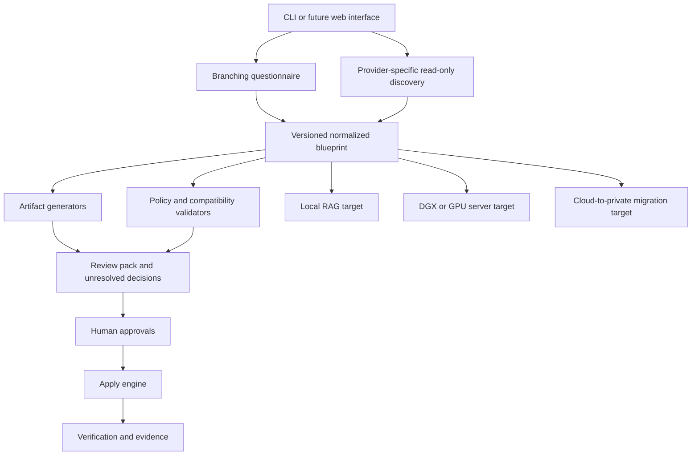
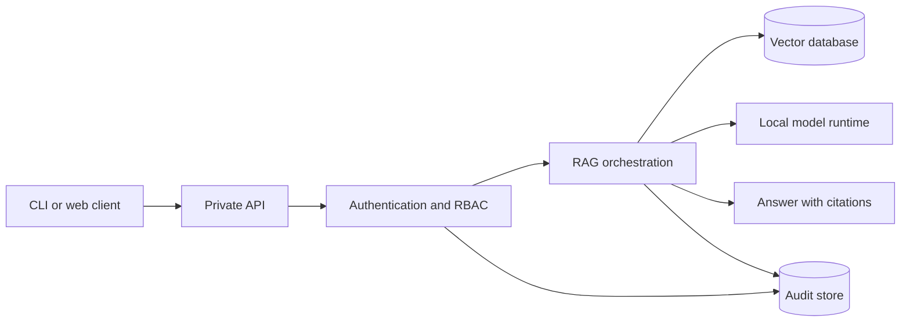

# Architecture

The product is a guided architect, not only a RAG application. It turns
workflow-specific answers and narrowly approved discovery results into a
normalized blueprint, then uses that blueprint to generate, validate, review,
and eventually verify private-AI deployments.

The local RAG stack is the first reference target. It proves that the generated
runtime configuration works before the project expands into private hardware
integration and cloud migration.

## Product Architecture



`apply`, production verification, shadow traffic, and cutover remain planned.
They must not be implied by the current dry-run implementation.

## Architectural Layers

| Layer | Responsibility |
| --- | --- |
| Experience | CLI today; later a web interface using the same workflow APIs. |
| Question graph | Ask only questions relevant to local RAG, new hardware, or cloud migration. |
| Discovery plugins | Read a narrow provider scope with documented least-privilege permissions. |
| Blueprint | Store versioned intent, facts, unresolved decisions, governance requirements, and approvals. |
| Generators | Render proposed runtime, model, network, identity, data, cloud, migration, and rollback artifacts. |
| Validators | Check schema, security, compatibility, completeness, review state, and target-specific rules. |
| Apply adapters | Perform explicitly approved infrastructure changes; intentionally absent today. |
| Verification | Compare the deployed target with the blueprint and acceptance criteria. |
| Evidence | Export decisions, discovery scope, checks, warnings, approvals, and test results. |

## Blueprint As The Source Of Truth

The blueprint must be provider-neutral at its core. Provider details belong in
typed source, gateway, and target sections rather than being scattered across
templates.

```text
Question answers + approved discovery
  -> normalized blueprint
  -> target-specific generators
  -> target-specific validators
  -> review and approval
  -> apply and verify
```

Every generated file should record:

- Blueprint schema version
- Generation timestamp
- Target profile
- Generator version
- Input checksum
- Whether it is proposed or applied
- Owning reviewer

Unknown values must remain unresolved. Generators must not silently invent
production network ranges, identity settings, compliance applicability, model
capacity, or rollback criteria.

## Plugin Boundaries

Plugins should be small and independently testable:

- **Source discovery:** Azure OpenAI, AWS Bedrock, or another approved source.
- **Target:** local CPU/RTX, generic NVIDIA GPU server, DGX Spark, or later
  enterprise targets.
- **Runtime:** Ollama, vLLM, NVIDIA NIM, or another compatible runtime.
- **Gateway:** local-only, VPN, Azure, AWS, or another reviewed access path.
- **Artifact generator:** Docker Compose, runtime config, Terraform, policies,
  migration plan, or evidence report.
- **Validator:** security, schema, provider, model compatibility, capacity, or
  governance evidence.

A discovery plugin may report facts. It must not mutate source infrastructure.
A generator may produce proposed files. It must not apply them.

## Reference RAG Runtime



The first runtime target should use Docker Compose so a developer or small
business can run it without Kubernetes. Candidate components remain FastAPI,
Qdrant, Ollama, and Postgres, but implementation and testing decide the final
defaults.

## Optional Knowledge And Optimization Layer

After the cited RAG path and its permissions are stable, the project may add:

- An LLM-maintained Markdown wiki derived from immutable approved sources
- A review queue for generated knowledge changes
- Source provenance, access inheritance, contradiction, and freshness checks
- Read-only MCP tools for approved coding agents
- Database-native vector compression after retrieval benchmarks
- Runtime-native KV-cache optimization after capability checks

Knowledge memory and compute memory are separate concerns. The complete
contract, support snapshot, schema proposal, and acceptance criteria are in
[Knowledge Workspace And Memory Optimization](knowledge-workspace-and-memory-optimization.md).

## Hybrid Gateway Patterns

There are two different privacy patterns and the blueprint must not confuse
them.

### Cloud-Relayed Data Plane

```text
Remote user
  -> cloud edge, identity, WAF, and API gateway
  -> private connection
  -> on-premises ingress and admission control
  -> private RAG and model runtime
```

Prompts and responses transit the cloud gateway. Documents, embeddings, model
weights, vector storage, and retained sensitive logs may remain on-premises.
Cloud payload logging must be disabled or explicitly approved.

### Cloud-Managed Control Plane

```text
Cloud identity, policy, and monitoring
  -> authorizes private access

Remote user
  -> VPN or zero-trust private data path
  -> on-premises ingress
  -> private RAG and model runtime
```

This pattern can keep request payloads off a managed cloud proxy while still
using cloud identity and management services. The selected design depends on
latency, remote access, residency, and security requirements.

## Trust Boundaries

The main boundaries are:

- User device to cloud or private ingress
- Cloud gateway to private network
- Application to source connectors
- Application to vector database
- Application to model runtime
- Control plane to data plane
- Discovery process to provider API
- Generator to apply adapter
- Runtime to audit and telemetry destinations

Each boundary needs an owner, allowed data classes, authentication method,
network rule, logging policy, and failure behavior.

## Data And Request Flow

1. A data owner approves a source.
2. Ingestion scans only approved paths.
3. Denied files and secret-like content are rejected or quarantined.
4. Documents are chunked and tagged with ownership and access metadata.
5. Embeddings are generated in the approved processing location.
6. Vectors and metadata are stored in the approved storage location.
7. A user query is authenticated and checked against RBAC.
8. Retrieval searches only collections allowed for that identity.
9. The model receives only approved retrieved context.
10. The answer includes citations and appropriate refusal behavior.
11. Redacted audit events are written to approved destinations.

## Discovery Architecture

Cloud discovery is read-only and scope-limited:

```text
Preflight permission manifest
  -> customer-controlled temporary credentials
  -> provider-specific API client
  -> allowlisted resource types and fields
  -> redaction
  -> discovery snapshot with provenance
```

The first planned cloud scope is selected Azure OpenAI deployment metadata, not
a complete Azure subscription inventory. AWS Bedrock and other plugins should
be separate milestones.

## Apply And Migration Safety

The architecture must enforce separation between:

- Discover and mutate
- Generate and apply
- Validate and approve
- Verify and cut over
- Framework-aware evidence and legal compliance determination

Production traffic management requires tested health checks, admission control,
capacity limits, quality thresholds, traffic splitting, fallback triggers, and
rollback. It belongs after the local runtime, target profile, and provider
integration are proven.

## Architecture Rules

- The current implementation must describe generated files as proposed.
- Model runtimes and databases must not be exposed directly to the internet.
- Retrieval must enforce identity and collection permissions before model use.
- Discovery credentials must be least-privilege and must not be persisted.
- Provider discovery must not read prompt or response content by default.
- Storage, processing, and transit locations must be represented separately.
- Production mode must require audit logging and named owners.
- Unknown critical answers must block apply.
- Compliance reports must never claim certification.
- Generated wiki pages must remain derived, cited, permission-scoped, and
  invalidated when their sources change.
- Lossy vector or KV-cache compression must remain disabled until a
  target-specific benchmark passes.
- Every apply action must require explicit approval and support verification.
- Migration cutover must have documented rollback criteria.

## Primary Architecture References

- [NVIDIA DGX Spark User Guide](https://docs.nvidia.com/dgx/dgx-spark/index.html)
- [AWS API Gateway private integrations](https://docs.aws.amazon.com/apigateway/latest/developerguide/private-integration.html)
- [AWS Site-to-Site VPN architecture](https://docs.aws.amazon.com/vpn/latest/s2svpn/how_it_works.html)
- [Azure API Management self-hosted gateway](https://learn.microsoft.com/azure/api-management/self-hosted-gateway-overview)
- [Azure VPN Gateway](https://learn.microsoft.com/azure/vpn-gateway/vpn-gateway-about-vpngateways)
