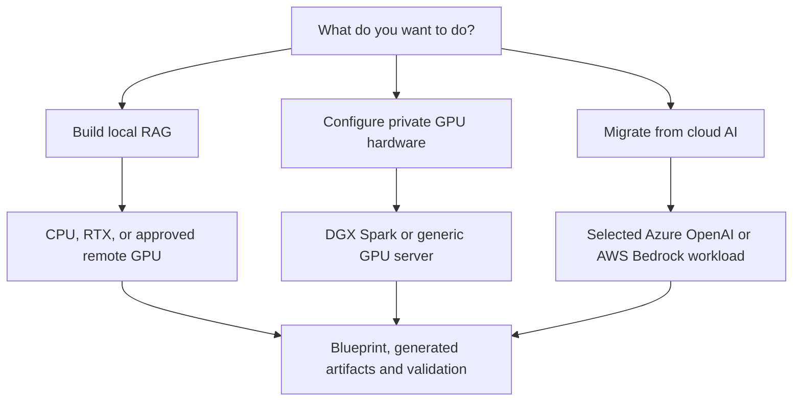
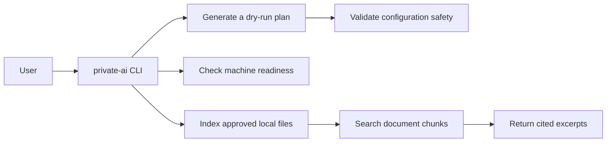
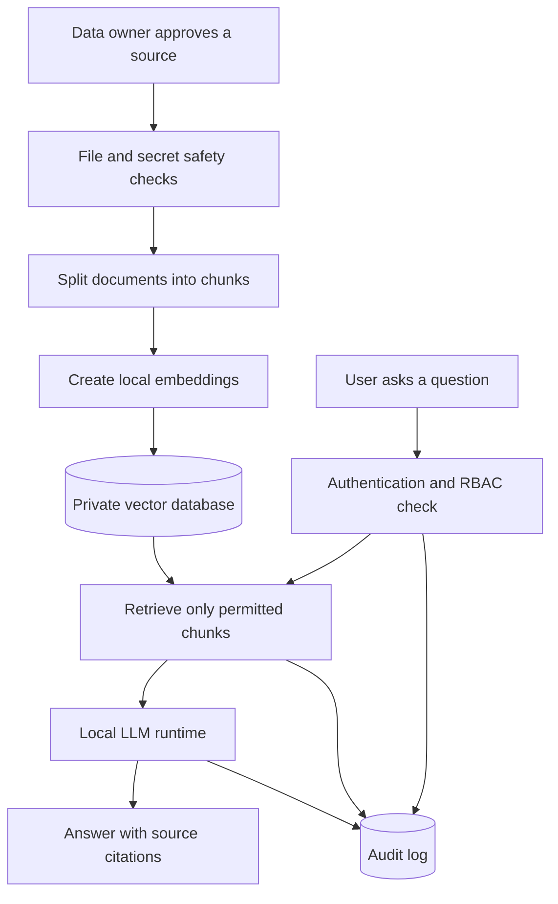
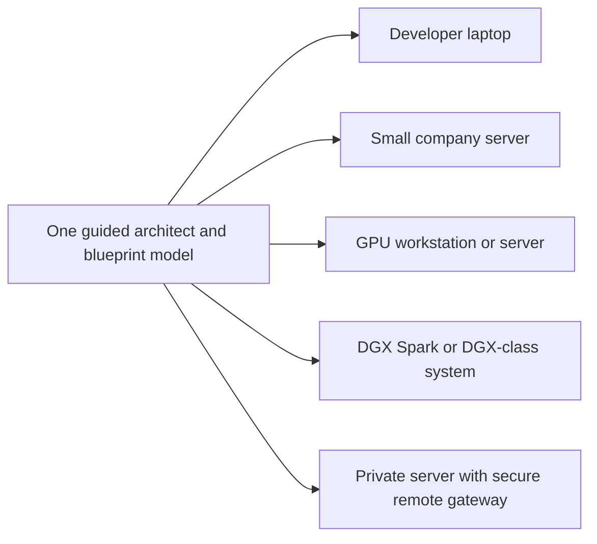
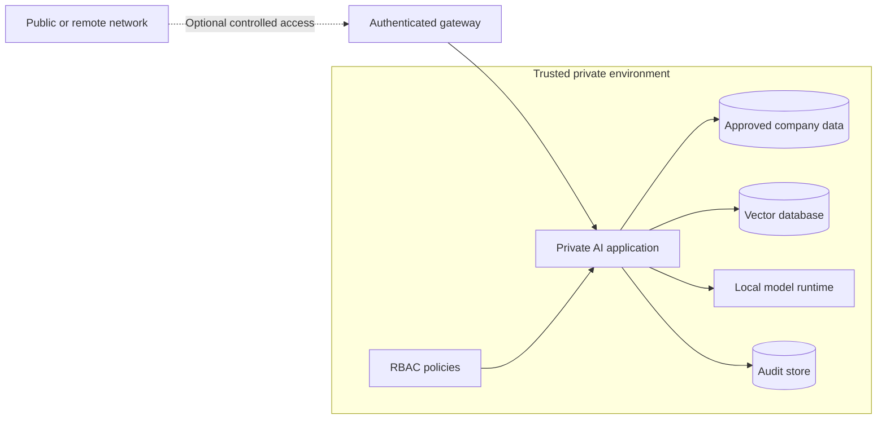

# Beginner's Guide

This guide explains Private AI Infrastructure Blueprint without assuming that
you already understand AI infrastructure, migration, RAG, vector databases, or
GPU servers.

> **Project status:** Basic dry-run planning, validation, machine checks,
> document indexing, and cited document search work today. The complete guided
> questionnaire, normalized blueprint, model-generated answers, hardware
> deployment, cloud discovery, and migration automation are planned.

## The Project In One Minute

Companies and developers often want AI to answer questions about private files,
code, policies, or logs. Sending those files to an unknown external service may
create privacy and security risks.

This project is building a guided architect that makes the path safer:

1. Choose which files AI is allowed to use.
2. Keep those files and their search index in a trusted environment.
3. Check the user's permission before searching.
4. Find the most relevant information.
5. Ask a locally hosted AI model to answer from that information.
6. Show citations so the answer can be verified.
7. Record important actions in an audit log.
8. For migrations, verify the target and preserve a rollback path before
   production traffic changes.

The current release provides the first planning and local search foundations.
The working local RAG reference comes next, followed by private hardware and
cloud migration workflows.

## Three Ways To Use The Project



The future questionnaire will branch immediately. A local developer should not
see Azure network questions, while a cloud migration should require source,
identity, compatibility, verification, and rollback decisions.

## What The Important Words Mean

| Term | Simple meaning |
| --- | --- |
| Private AI | AI that runs within an environment you trust and control. |
| LLM | The language model that reads context and writes an answer. |
| RAG | A process that finds relevant private information before asking an LLM to answer. |
| Ingestion | Reading approved files and preparing them for search. |
| Chunk | A small section of a document that can be searched independently. |
| Embedding | A numerical representation used to find text with similar meaning. |
| Vector database | A database designed to store and search embeddings. |
| RBAC | Role-based access control: rules that decide who may access each collection. |
| Audit log | A history of important actions, such as ingestion, searches, and admin changes. |
| Dry run | Generate and inspect a plan without deploying or changing infrastructure. |
| Blueprint | The versioned source of truth containing intent, configuration, unresolved decisions, and owners. |
| Discovery | Read an explicitly approved provider scope without changing it. |
| Cutover | Move controlled production traffic from the old system to the verified target. |

## What Works Today

The current command-line tool provides a safe local preview:



It can:

- Generate a reviewable deployment plan without applying changes.
- Validate generated files for common unsafe settings.
- Report whether Python, Git, Docker, NVIDIA tools, and Ollama are available.
- Index approved Markdown, text, log, YAML, and JSON files.
- Skip likely secret, credential, key, token, and `.env` files.
- Find relevant excerpts and show where they came from.

It does **not** currently ask an LLM to write an answer. The `chat` command is a
retrieval preview, so its output is source text rather than generated text.

## The First Planned Runtime: Local RAG

This is the full workflow the project is working toward:



The central rule is simple: a model must receive only information that the
current user is allowed to access.

The RAG runtime is the first reference target, not the entire product. Once it
works reliably, the same blueprint and validation engine can generate and
verify private hardware and migration configurations.

## Where The System Runs

The same design can support several sizes of deployment:



| Deployment | Intended use |
| --- | --- |
| Developer laptop | Learning, prototyping, and searching a small approved folder. |
| Small company server | A shared internal assistant for a small team. |
| GPU workstation/server | Faster models and more concurrent users. |
| DGX-class system | Larger models, higher throughput, and enterprise workloads. |
| Hybrid gateway | Cloud-integrated remote access with explicit data-transit rules. |

Expensive hardware is not required to start. A normal computer can run the
dry-run and retrieval preview. Model speed and model size determine when a GPU
becomes useful.

## Security Boundaries

Private AI is not secure merely because it runs locally. Permissions, network
controls, secret filtering, and auditing are still required.



The model runtime and databases should not be exposed directly to the public
internet. Remote access should pass through an authenticated gateway.

When a managed cloud gateway proxies requests, prompts and responses transit
the cloud even if documents, embeddings, models, and storage stay on-premises.
The project must show storage, processing, transit, logging, and telemetry
locations separately.

## Try The Current Version

### 1. Install

You need Python 3.11 or newer.

On Windows PowerShell:

```powershell
python -m venv .venv
.\.venv\Scripts\Activate.ps1
python -m pip install -e .
```

On macOS or Linux:

```bash
python3 -m venv .venv
source .venv/bin/activate
python -m pip install -e .
```

### 2. Check Your Computer

```bash
private-ai doctor
```

A warning about Ollama is expected if it is not installed. Ollama is not needed
for dry-run planning or retrieval-only search. It is needed only when the user
explicitly passes `--model` for a local generated answer.

### 3. Generate A Safe Plan

```bash
private-ai init --dry-run --mode local-developer --project-name my-private-ai --output-dir generated/dry-run --force
private-ai validate generated/dry-run
```

This creates documentation and example configuration under
`generated/dry-run/`. It does not start containers, change firewall rules,
connect to company systems, or deploy a model.

### 4. Index The Included Sample Documents

```bash
private-ai ingest examples/sample-company-docs --collection docs --output-dir generated/index --force
```

Only use the included sample files or other data you are authorized to process.
Never test with real credentials or confidential company data.

### 5. Search The Documents

```bash
private-ai chat "What are the AI usage rules?" --index generated/index/index.json
```

The command returns relevant excerpts and their source paths. This demonstrates
the retrieval and citation foundation that a local LLM will use later.

## Current And Future Capabilities

| Capability | Status |
| --- | --- |
| Dry-run architecture and configuration generation | Working |
| Generated configuration validation | Working |
| Local environment checks | Working |
| Local file indexing with denied-file rules | Working |
| Retrieval with source citations | Working |
| Complete branching questionnaire | Planned |
| Normalized versioned blueprint | Planned |
| Local LLM-generated answers | Planned |
| Semantic embedding and vector database | Planned |
| Web chat and administration interface | Planned |
| Login, SSO, and production RBAC enforcement | Planned |
| Production audit database | Planned |
| Docker deployment | Planned |
| Tested DGX deployment profile | Planned |
| Narrow Azure OpenAI discovery | Planned after hardware profiles |
| Production shadowing, canary, and rollback | Later milestone |

## What We Will Build Next

The next useful milestone is a complete local RAG loop:

1. Connect a local model through Ollama.
2. Add local embeddings and a vector database.
3. Generate answers using only retrieved context.
4. Include citations with every answer.
5. Add automated checks for unsupported or ungrounded answers.
6. Package the services with Docker Compose.

After that foundation is reliable, the project can add a web interface,
authentication, stronger RBAC, a branching blueprint workflow, GPU server
profiles, tested DGX Spark deployment guidance, narrow cloud discovery, and
staged migration tooling.

An optional later extension may combine normal RAG with a reviewed Markdown
wiki that accumulates linked knowledge over time. The project may also detect
supported vector or model-memory compression, but only after quality
benchmarks. See
[Knowledge Workspace And Memory Optimization](knowledge-workspace-and-memory-optimization.md).

## Frequently Asked Questions

### Does this send my files to an external AI service?

The current ingestion and search commands operate locally. The intended default
architecture also keeps documents, embeddings, prompts, and model inference in
the approved environment. Future cloud-relayed gateways may carry prompts and
responses through cloud infrastructure, so transit and logging must be explicit
rather than described as fully on-premises.

### Is it production-ready?

No. It is an early implementation with working planning and retrieval tools.
Do not use it as a production security boundary yet.

### Do I need a DGX system?

No. Start on a developer machine. DGX-class hardware is relevant when model
size, speed, or the number of users requires substantially more GPU capacity.

### Can I use real company documents?

Only after the data owner and security team approve the source and deployment.
Use synthetic sample data while evaluating the current early release.

### Why are citations important?

An AI answer can sound confident and still be wrong. Citations let users inspect
the exact source material and decide whether the answer is trustworthy.

### Why start with a dry run?

AI infrastructure touches private data, networks, models, and access controls.
A dry run gives developers, security teams, and data owners something concrete
to review before any infrastructure is changed.

### Can it certify HIPAA, GDPR, or another framework?

No. Framework selections can activate questions, checks, and evidence
requirements. Authorized legal, privacy, security, and compliance reviewers
must determine applicability and compliance.

## Where To Read Next

- [CLI Reference](cli-reference.md) for every available command.
- [Guided Architect Workflow](guided-architect-workflow.md) for the three user journeys.
- [Architecture](architecture.md) for engineering-level component details.
- [Security Principles](security-principles.md) for mandatory safety rules.
- [Deployment Modes](deployment-modes.md) for environment choices.
- [Roadmap](roadmap.md) for planned implementation stages.
