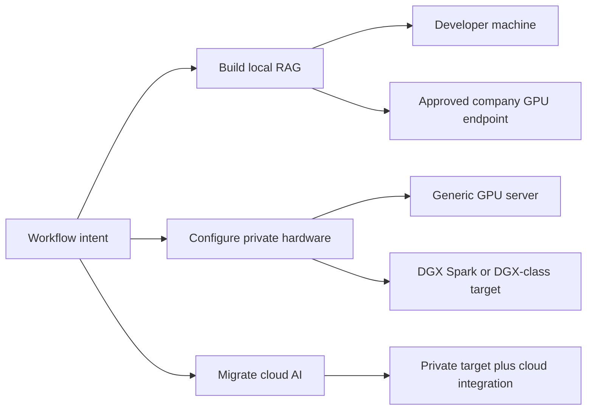

# Deployment Modes

Workflow intent and deployment target are separate decisions.

First, the guided architect asks whether the user wants to build local RAG,
configure new private hardware, or migrate a cloud AI workload. It then asks
only the questions required to select and validate a target profile.

The current v0.1 CLI exposes six planning profiles. Future schema versions will
separate `workflow.intent` from `target.type` while preserving compatible
profile aliases where practical.

## Workflow And Target Selection

## Current Planning Profiles

| CLI mode | Best for | Default exposure | Runtime status |
| --- | --- | --- | --- |
| `local-developer` | Developer proof of concept | Localhost only | Dry-run and retrieval preview |
| `small-company` | Shared internal assistant planning | LAN or VPN | Dry-run |
| `gpu-server` | Dedicated GPU service planning | LAN or VPN | Dry-run |
| `dgx-enterprise` | DGX-class planning | Enterprise network | Dry-run; not hardware-verified |
| `hybrid-gateway` | Cloud/private gateway planning | Gateway plus private path | Dry-run |
| `dry-run-only` | Architecture review | None | Dry-run |

These modes generate proposed artifacts. They do not deploy containers, cloud
resources, networks, or model runtimes.

## Local Developer Target

Use for a developer with approved files and a CPU or RTX-class GPU.

Defaults:

- Localhost-only access
- Docker Compose target
- Approved local folders
- Ollama or another compatible local runtime
- Read-only retrieval and citations
- No production company data without approval

Validation must block broad home-directory ingestion, secret-like files,
unreviewed public binding, and direct model exposure.

## Small Company Target

Use for a shared internal assistant or a small business integrating its first
private GPU system.

Defaults:

- LAN-only, VPN-only, or approved zero-trust access
- Role-based document collections
- Audit logging required
- Named data, security, network, and operations owners
- Docker Compose until scale or availability requires another orchestrator
- Backup, restore, monitoring, and capacity plans required for production

## Generic GPU Server Target

Use when a company owns a GPU workstation or server that will serve multiple
users or larger document collections.

Validation must check:

- CPU architecture, GPU, driver, container runtime, and model compatibility
- Memory and disk assumptions
- Concurrent request limits and admission control
- Collection-level RBAC
- Monitoring, audit retention, backup, and recovery
- Network segmentation and ingress ownership

## DGX Spark Target

Use when integrating DGX Spark as a local development, pilot, or carefully
reviewed service target.

The target profile must account for:

- ARM64 compatibility
- Supported NVIDIA container and runtime versions
- Verified NIM or vLLM model combinations
- Unified-memory behavior
- Model storage and download requirements
- Capacity, concurrency, and thermal assumptions
- Lack of high availability when only one device exists

The project must not imply that one DGX Spark automatically provides an
enterprise-grade highly available service.

## DGX-Class Or Enterprise Target

Use for larger multi-user systems with formal operations and security review.

Expected requirements:

- Enterprise identity integration
- Network segmentation
- Separate administration and runtime access
- Central monitoring and audit export
- Resource quotas and workload isolation
- Change approval and rollback
- High-availability and disaster-recovery decisions

Specific hardware and orchestration profiles should be implemented and tested
individually rather than hidden behind a generic "enterprise" claim.

## Hybrid Cloud Gateway Target

Use when cloud-integrated organizations retain cloud identity, edge security,
gateway, or monitoring while moving selected inference and data processing to
private infrastructure.

The blueprint must choose one of two patterns:

1. **Cloud-relayed data plane:** prompts and responses transit the cloud
   gateway before reaching private infrastructure.
2. **Cloud-managed control plane:** cloud identity and management authorize a
   direct VPN or zero-trust private data path.

Required controls include:

- Cloud WAF and edge rate limits where relevant
- On-premises admission control and concurrency limits
- Private connectivity with named ownership
- Direct model and database exposure blocked
- Payload logging explicitly disabled or approved
- Storage, processing, transit, and telemetry locations documented separately

Cloud services can reduce exposure, but they do not prevent valid-looking
requests from exhausting private model capacity.

## Cloud Migration Source Profiles

Migration sources are discovery plugins, not deployment targets.

Planned order:

1. Narrow Azure OpenAI deployment discovery
2. Azure hybrid gateway generation
3. Shadow and cutover planning
4. AWS Bedrock discovery
5. AWS hybrid gateway generation

Each plugin must publish its exact read permissions and supported resource
types. Full cloud-account inventory is out of scope.

## Dry-Run Planning

Dry-run is a lifecycle behavior available to every workflow and target, not a
hardware type.

Dry-run must not:

- Start containers
- Change firewall or cloud resources
- Create users or roles
- Download models
- Ingest real company data
- Expose ports
- Persist provider credentials

Generated files must be marked proposed and list unresolved decisions.
