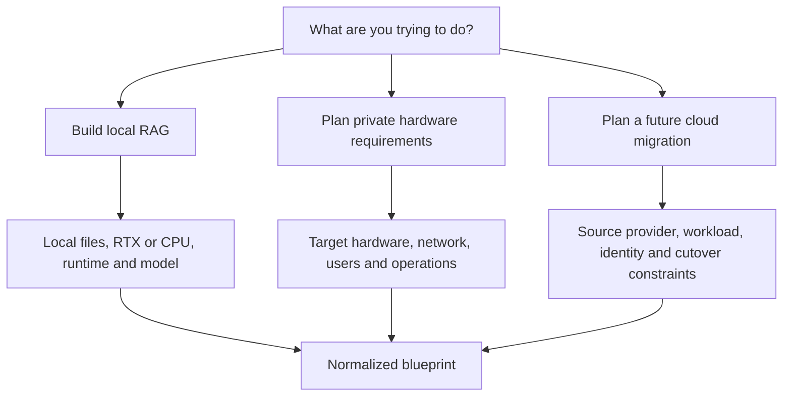
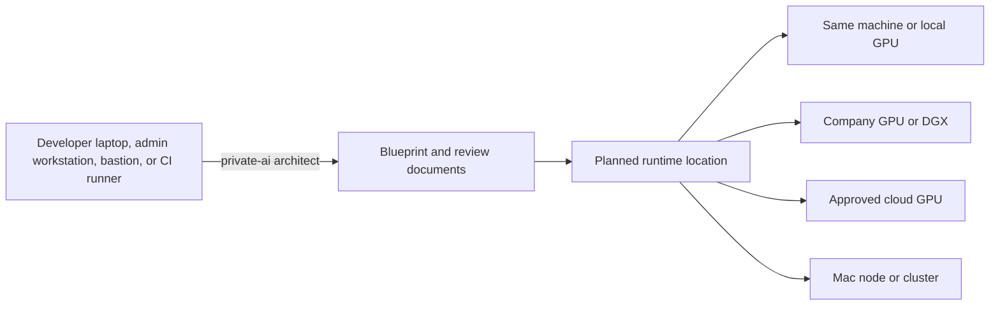

# Guided Architect Workflow

This document defines how one product serves three different private-AI
journeys without forcing every user through the same questions.

## Start With Intent

The first decision is what the user is trying to accomplish:



The questionnaire is a decision graph, not one long form. Answers determine
which questions become relevant. Unknown answers remain unresolved and may
become validation blockers.

## Where The Command Runs

The planning command and the future AI runtime are separate:



v0.3 runs only on the control machine and stops after writing the review pack.
It does not contact any target. The blueprint separately records:

- `architect_location`: where the CLI is executed
- `runtime_location`: where the future model, index, and retrieval service are
  intended to run
- `data_location`: where data is approved for storage and processing

The governing rule is that ingestion and indexing must run where the data is
allowed to exist. A blueprint created on a developer laptop does not permit
company data to be copied there.

## Current v0.3 Command

Run the beginner-friendly interactive questionnaire:

```bash
private-ai architect
```

Or use one of the non-interactive synthetic examples:

```bash
private-ai architect --answers-file examples/architect/local-rag-answers.json --output-dir generated/architect-local --force
private-ai architect --answers-file examples/architect/private-gpu-answers.json --output-dir generated/architect-gpu --force
private-ai architect --answers-file examples/architect/cloud-migration-answers.json --output-dir generated/architect-cloud --force
```

The command follows this bounded flow:

```text
ask journey
  -> ask only relevant questions
  -> normalize answers
  -> record unknowns and risks
  -> generate blueprint.json and review documents
  -> validate schema and planning boundaries
  -> stop
```

It does not read the named document sources. It does not call cloud APIs,
inspect hardware, generate provider configuration, deploy, or migrate.

Every journey produces:

- `blueprint.json`
- `summary.md`
- `decisions-needed.md`
- `security-risks.md`
- `next-steps.md`
- `validation-report.md`

See [Blueprint Schema](blueprint-schema.md) for the exact machine-readable
contract.

## Workflow A: Build Local RAG

Intended user:

- A developer using a CPU, RTX GPU, or approved remote company GPU service.

Questions include:

- Which folders are approved?
- Which files and patterns must be denied?
- Is inference local or through a company-private endpoint?
- Which runtime and model are compatible with the machine?
- Is access localhost-only, LAN-only, or through an approved remote path?
- Are citations and refusal on missing evidence required?

v0.3 records these answers in the normalized blueprint and common review
documents. The existing v0.2 local RAG commands remain separate; architect
does not automatically ingest documents or start Ollama.

This is the first reference implementation because it proves ingestion,
retrieval, model inference, citations, and safe defaults on accessible
hardware.

## Workflow B: Plan New Private Hardware

Intended user:

- A small business or infrastructure team integrating DGX Spark, a generic
  NVIDIA GPU server, or another supported private target.

Questions include:

- What hardware and CPU architecture are present?
- Which models, quantizations, and runtimes are supported?
- How many users and concurrent requests are expected?
- Which existing applications must call the new service?
- Where do documents, vectors, models, logs, and backups live?
- What identity, network, monitoring, and recovery systems already exist?
- Is this a pilot, shared internal service, or production target?

v0.3 records hardware availability, target hardware, deployment stage, users,
network exposure, identity needs, audit needs, unknowns, and risks. It does not
generate hardware configuration or claim compatibility. Compatibility reports,
runtime configuration, and deployment runbooks belong to the verified hardware
profile milestone.

DGX Spark is one target profile, not the definition of the product. Its ARM64
architecture and verified model/runtime combinations require their own
compatibility checks.

## Workflow C: Plan A Future Cloud AI Migration

Intended user:

- A company moving selected workloads from Azure OpenAI, AWS Bedrock, or
  another supported source to private GPU infrastructure.

Questions include:

- Which provider and specific AI workload are in scope?
- Which deployed models, API versions, regions, quotas, and clients are used?
- Which identity, gateway, monitoring, and audit services should remain?
- May request payloads transit the cloud gateway?
- Which data must remain on-premises for storage and processing?
- What latency, quality, throughput, and availability targets must be preserved?
- What shadow, acceptance, rollback, and approval criteria apply?

v0.3 records the operator-provided source provider, workload description, and
rollback requirement. It does not authenticate, discover resources, generate
provider configuration, or execute migration. Provider inventory,
compatibility analysis, gateway plans, and migration runbooks belong to later
provider-specific milestones.

Migration is incremental. The project must not imply that generating
configuration is equivalent to proving production readiness.

## Vendor-Aware RAG Direction

Private AI Architect should not assume that every company wants to leave its
existing cloud. If approved data, identity, logging, and governance already
live in AWS or Azure, a cloud-native RAG plan may be safer than moving data to
new local hardware.

The guided product should eventually distinguish:

- a first-time user starting RAG from zero
- an existing environment choosing local, AWS-native, Azure-native, private
  GPU/DGX, cloud GPU, Mac, or hybrid RAG
- an existing AI workload explicitly choosing migration planning

Provider-native recommendation requires additional normalized fields for
cloud allowance, current data environment, use case, access model, read-only
intent, and recommended architecture path. Those fields and recommendation
rules are documented design work, not implemented v0.3 behavior.

No recommendation may call provider APIs or deploy infrastructure. See
[Starting RAG From Scratch](starting-rag-from-scratch.md).

## Controlled Lifecycle

| Stage | Purpose | Mutation allowed? | Current status |
| --- | --- | --- | --- |
| `discover` | Read an explicitly approved provider scope. | No | Planned |
| `plan` | Record decisions and unresolved questions. | No | Available through `private-ai architect` |
| `generate` | Render a blueprint and review documents. | No | Available for the v0.3 planning scope |
| `validate` | Run schema and planning-safety checks. | No | Available through `private-ai blueprint validate` |
| `review` | Collect domain-owner decisions and approvals. | No | Documented; workflow automation planned |
| `apply` | Create or change approved infrastructure. | Yes | Intentionally blocked |
| `verify` | Test the target against the blueprint. | Test traffic only | Planned |
| `shadow` | Compare source and target without serving target responses. | Mirrored traffic | Later milestone |
| `cutover` | Move controlled production traffic to the target. | Yes | Later milestone |
| `rollback` | Return traffic to the approved previous state. | Yes | Later milestone |
| `evidence` | Export decisions, validation, approvals, and test results. | No | Planned |

## Discovery Contract

Discovery must be narrow and provider-specific.

The first cloud discovery milestone should inspect only an explicitly selected
Azure OpenAI workload, such as deployed models, endpoint metadata, API
versions, regions, quotas, and relevant configuration. It must not promise a
complete Azure subscription inventory.

Every discovery plugin must:

- Publish the exact read permissions it requires.
- Support a preflight that requests no credentials.
- Use customer-controlled credentials.
- Avoid persisting access tokens or secrets.
- Avoid reading prompts, responses, or document payloads by default.
- Redact sensitive identifiers from exported reports when configured.
- Log which provider APIs and resources were inspected.
- Fail closed when scope or permission is ambiguous.

AWS Bedrock and other sources should be separate plugins added only after their
scope and permission model are tested.

## Cutover Contract

Canary cutover is production traffic management, not a documentation feature.
It requires:

- Source and target health checks
- Capacity and concurrency limits
- Request timeouts and circuit breakers
- Quality, latency, error-rate, and cost thresholds
- A reviewed traffic-splitting mechanism
- Automatic and manual fallback criteria
- An application-compatible rollback path
- Named operators and approvers

The first migration releases should generate and validate a cutover plan.
Automated shadowing and traffic changes belong in later milestones after the
reference runtime and provider integrations are proven.

## Cloud Gateway Privacy Statement

When a managed cloud gateway proxies an AI request, the prompt and response
transit that cloud environment even if documents, embeddings, models, and
stored logs remain on-premises.

The blueprint must separately record:

- Storage location
- Processing location
- Transit path
- Cloud payload logging policy
- Telemetry and metadata destinations

Documentation must not claim that data "never leaves the building" when
request payloads pass through a cloud gateway.

## Human Ownership

Automation may propose configurations and tests. Humans remain responsible for:

- Business scope and risk acceptance
- Data-source authorization
- Legal and regulatory applicability
- Identity and access approval
- Network and remote-access approval
- Production change approval
- Cutover and rollback decisions
