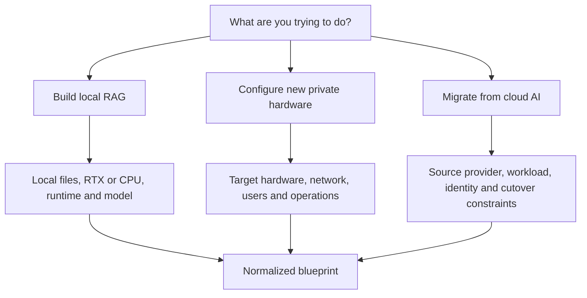

# Guided Architect Workflow

This document defines how one product serves three different private-AI
journeys without forcing every user through the same questions.

## Start With Intent

The first decision is what the user is trying to accomplish:

The questionnaire is a decision graph, not one long form. Answers determine
which questions become relevant. Unknown answers remain unresolved and may
become validation blockers.

## Workflow A: Build Local RAG

Intended user:

- A developer using a CPU, RTX GPU, or approved remote company GPU service.

Questions include:

- Which folders are approved?
- Which files and patterns must be denied?
- Is inference local or through a company-private endpoint?
- Which runtime and model are compatible with the machine?
- Is access localhost-only, LAN-only, or through an approved remote path?
- Are citations and refusal on missing evidence required?

Generated artifacts include:

- Local Docker Compose plan
- Model and embedding configuration
- Approved and denied data-source policy
- Retrieval and citation policy
- Local network plan
- Validation report

This is the first reference implementation because it proves ingestion,
retrieval, model inference, citations, and safe defaults on accessible
hardware.

## Workflow B: Configure New Private Hardware

Intended user:

- A small business or infrastructure team integrating DGX Spark, a generic
  NVIDIA GPU server, or another supported private target.

Questions include:

- What hardware and CPU architecture are present?
- Which models, quantizations, and runtimes are supported?
- How many users and concurrent requests are expected?
- Which existing applications must call the new service?
- Where do documents, vectors, models, logs, and backups live?
- What identity, network, monitoring, and recovery systems already exist?
- Is this a pilot, shared internal service, or production target?

Generated artifacts include:

- Hardware compatibility report
- Runtime and model configuration
- Capacity assumptions and unresolved load-test requirements
- Network segmentation and ingress plan
- Identity and RBAC integration plan
- Monitoring, backup, and recovery plan
- Deployment, verification, and rollback runbooks

DGX Spark is one target profile, not the definition of the product. Its ARM64
architecture and verified model/runtime combinations require their own
compatibility checks.

## Workflow C: Migrate From Cloud AI

Intended user:

- A company moving selected workloads from Azure OpenAI, AWS Bedrock, or
  another supported source to private GPU infrastructure.

Questions include:

- Which provider and specific AI workload are in scope?
- Which deployed models, API versions, regions, quotas, and clients are used?
- Which identity, gateway, monitoring, and audit services should remain?
- May request payloads transit the cloud gateway?
- Which data must remain on-premises for storage and processing?
- What latency, quality, throughput, and availability targets must be preserved?
- What shadow, acceptance, rollback, and approval criteria apply?

Generated artifacts include:

- Source workload inventory for the approved discovery scope
- Source-to-target model and API compatibility report
- Target deployment configuration
- Cloud gateway and private connectivity plan
- Application change checklist
- Evaluation dataset requirements
- Migration, verification, and rollback plan
- Framework-aware evidence checklist

Migration is incremental. The project must not imply that generating
configuration is equivalent to proving production readiness.

## Controlled Lifecycle

| Stage | Purpose | Mutation allowed? | Current status |
| --- | --- | --- | --- |
| `discover` | Read an explicitly approved provider scope. | No | Planned |
| `plan` | Record decisions and unresolved questions. | No | Partly available through dry-run |
| `generate` | Render proposed configuration and review artifacts. | No | Available for the current dry-run scope |
| `validate` | Run safety and completeness checks. | No | Available for generated dry-run packs |
| `review` | Collect domain-owner decisions and approvals. | No | Documented; workflow automation planned |
| `apply` | Create or change approved infrastructure. | Yes | Intentionally blocked |
| `verify` | Test the target against the blueprint. | Test traffic only | Planned |
| `shadow` | Compare source and target without serving target responses. | Mirrored traffic | Later milestone |
| `cutover` | Move controlled production traffic to the target. | Yes | Later milestone |
| `rollback` | Return traffic to the approved previous state. | Yes | Later milestone |
| `evidence` | Export decisions, validation, approvals, and test results. | No | Planned |

## Discovery Contract

Discovery must be narrow and provider-specific.

The first cloud discovery milestone should inspect only an explicitly selected
Azure OpenAI workload, such as deployed models, endpoint metadata, API
versions, regions, quotas, and relevant configuration. It must not promise a
complete Azure subscription inventory.

Every discovery plugin must:

- Publish the exact read permissions it requires.
- Support a preflight that requests no credentials.
- Use customer-controlled credentials.
- Avoid persisting access tokens or secrets.
- Avoid reading prompts, responses, or document payloads by default.
- Redact sensitive identifiers from exported reports when configured.
- Log which provider APIs and resources were inspected.
- Fail closed when scope or permission is ambiguous.

AWS Bedrock and other sources should be separate plugins added only after their
scope and permission model are tested.

## Cutover Contract

Canary cutover is production traffic management, not a documentation feature.
It requires:

- Source and target health checks
- Capacity and concurrency limits
- Request timeouts and circuit breakers
- Quality, latency, error-rate, and cost thresholds
- A reviewed traffic-splitting mechanism
- Automatic and manual fallback criteria
- An application-compatible rollback path
- Named operators and approvers

The first migration releases should generate and validate a cutover plan.
Automated shadowing and traffic changes belong in later milestones after the
reference runtime and provider integrations are proven.

## Cloud Gateway Privacy Statement

When a managed cloud gateway proxies an AI request, the prompt and response
transit that cloud environment even if documents, embeddings, models, and
stored logs remain on-premises.

The blueprint must separately record:

- Storage location
- Processing location
- Transit path
- Cloud payload logging policy
- Telemetry and metadata destinations

Documentation must not claim that data "never leaves the building" when
request payloads pass through a cloud gateway.

## Human Ownership

Automation may propose configurations and tests. Humans remain responsible for:

- Business scope and risk acceptance
- Data-source authorization
- Legal and regulatory applicability
- Identity and access approval
- Network and remote-access approval
- Production change approval
- Cutover and rollback decisions
