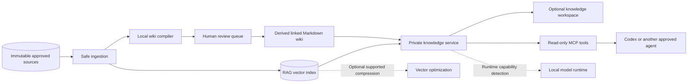

# Knowledge Workspace And Memory Optimization

Status: proposed optional extension. This is not implemented and does not
replace the local RAG MVP or the guided architect roadmap.

This design records two related ideas that solve different problems:

1. An optional LLM-maintained wiki that gives users and agents persistent,
   structured knowledge over time.
2. Optional vector and KV-cache compression that reduces machine memory use
   when the selected database or model runtime supports it.

## Two Meanings Of Memory

| Memory type | Problem | Proposed solution |
| --- | --- | --- |
| Knowledge memory | An agent repeatedly rediscovers and resynthesizes the same documents. | Immutable raw sources plus a reviewed, linked Markdown wiki. |
| Compute memory | Embeddings, vectors, long contexts, and model KV cache consume RAM or GPU memory. | Runtime-native quantization, cache reuse, offload, or TurboQuant where supported and benchmarked. |

The user interface may present both capabilities, but their configuration,
testing, risk, and implementation remain separate.

## Combined Architecture



Raw sources remain authoritative. The vector index and wiki are derived,
rebuildable views with provenance.

## Knowledge Modes

The guided architect may offer:

| Mode | Behavior | Best for |
| --- | --- | --- |
| `rag` | Retrieve source chunks at query time. | Exact evidence, smaller deployments, and the MVP. |
| `wiki` | Maintain linked Markdown summaries and concepts. | Persistent synthesis and human browsing. |
| `hybrid` | Use the wiki for accumulated understanding and RAG for source evidence. | Teams and agents working across evolving knowledge. |

`rag` remains the default until the wiki security, provenance, and review
contracts are implemented.

## Wiki Data Layers

### Raw Sources

- Approved source documents
- Immutable through the knowledge interface
- Versioned or content-hashed
- Original access-control metadata retained
- Never silently rewritten by the model

### Derived Wiki

- Markdown summaries
- Entity and concept pages
- Comparisons and decision records
- Contradiction and uncertainty notes
- Links to source IDs and exact chunks
- Freshness and review state

### Schema And Instructions

A generated schema file defines:

- Directory structure
- Page types
- Required frontmatter
- Citation format
- Naming and linking conventions
- Ingestion workflow
- Review and write permissions
- Staleness and contradiction behavior

For Codex, a project-scoped `AGENTS.md` may describe how an approved agent uses
the wiki tools. It must not grant broader source access than the user already
has.

### Index And Operation Log

- `index.md` is a compact content catalog for human and agent navigation.
- `log.md` is an append-only history of ingestion, generated changes, reviews,
  lint checks, and rebuilds.

The operation log is not a substitute for the security audit store.

## Proposed Page Metadata

```yaml
---
page_id: architecture/private-ai-gateway
page_type: concept
status: reviewed
generated_from:
  - source_id: policy-network-001
    chunks: ["chunk-12", "chunk-13"]
  - source_id: architecture-004
    chunks: ["chunk-07"]
effective_access:
  collections: ["network-private"]
freshness:
  source_revision: "sha256:..."
  checked_at: "2026-06-27T00:00:00Z"
review:
  required: true
  approved_by: "security-owner-reference"
---
```

Generated examples must use references, not real personal information or
credentials.

## Permission Rule

A generated wiki page may combine several sources. Its effective audience must
be the intersection of the audiences allowed to read every contributing
source.

```text
source A: engineering
source B: engineering + security

generated page effective access: engineering
```

If the source permission cannot be mapped safely, generation must stop or place
the page in a restricted review queue. A broad wiki collection must never
weaken source permissions.

## Wiki Lifecycle


Useful maintenance operations:

- Ingest one source or an approved batch
- Show proposed page changes
- Accept or reject generated changes
- Find missing citations
- Find contradictions
- Find orphan and duplicate pages
- Mark pages stale when sources change
- Rebuild derived indexes
- Export a provenance report

## Optional User Interface

The knowledge workspace may expose:

- **Sources:** approved documents, revisions, owners, and ingestion state
- **Wiki:** reviewed derived pages and source links
- **Graph:** relationships between pages and sources
- **Review queue:** proposed additions, updates, merges, and deletions
- **Contradictions:** claims that need human resolution
- **Freshness:** stale pages and changed sources
- **Search:** hybrid wiki and raw-source retrieval
- **History:** generated changes and reviewer decisions

The interface is optional. Markdown remains portable and usable through normal
editors such as Obsidian.

## Agent Interface

The private knowledge service can later expose read-only MCP tools:

```text
search_private_knowledge
get_source_excerpt
get_reviewed_wiki_page
list_page_sources
report_stale_knowledge
```

Write tools must be separate and approval-controlled:

```text
propose_wiki_update
review_wiki_update
publish_wiki_update
```

Connecting a cloud-hosted agent to a local MCP server does not make the agent
local. Any excerpts or answers returned to that agent may enter the agent
provider's processing environment. The wizard must distinguish:

- Strict local agent and local model
- External agent receiving minimal redacted excerpts
- External agent receiving only a locally generated answer

Each choice requires an explicit data-transit policy.

## Compute Memory Optimization

Optimization is an advanced target capability, not a beginner-facing promise.
The guided architect should inspect the selected vector database, model
runtime, hardware, versions, and supported features before proposing a setting.

### Vector Index

TurboQuant may reduce vector-index memory and preserve useful retrieval quality,
but it remains lossy compression and must be compared with the uncompressed
baseline on the organization's approved evaluation set.

The implementation should use a maintained database-native implementation when
available. It should not implement research mathematics independently inside
the project.

### Model KV Cache

KV cache grows with model size, context length, concurrency, and runtime
architecture. The project should prefer options officially supported by the
selected runtime:

- Native prefix or KV-cache reuse
- Supported lower-precision KV formats
- Host-memory offload
- Runtime-supported TurboQuant
- Shorter validated context limits
- Admission and concurrency control

TurboQuant must not be generated for an NVIDIA target merely because the
algorithm exists. The selected NVIDIA NIM or vLLM profile must explicitly
support it.

## Support Snapshot

This snapshot was reviewed on 2026-06-27 and must be revalidated before
implementation:

| Component | Observed support | Project treatment |
| --- | --- | --- |
| Qdrant 1.18 | Database-native TurboQuant vector indexing is documented. | Experimental option behind a retrieval benchmark and rollback. |
| vLLM Metal | TurboQuant KV-cache compression is documented for Apple Silicon. | Target-specific option; not evidence of RTX or DGX support. |
| NVIDIA NIM | KV-cache reuse and TensorRT-LLM host offload are documented. | Prefer documented native settings; do not assume TurboQuant. |
| Other runtimes | Not evaluated by this design. | Report unsupported or unknown until an adapter proves capability. |

## Proposed Blueprint Fields

```yaml
knowledge:
  mode: hybrid
  source_authority: immutable

  wiki:
    format: markdown
    path: ./knowledge/wiki
    writes: propose-and-review
    access_derivation: source-acl-intersection
    require_chunk_citations: true
    stale_on_source_change: true

  agent_interface:
    protocol: mcp
    default_tools: read-only
    external_agent_transit: unresolved

optimization:
  mode: auto

  vector_index:
    strategy: capability-detected
    preferred_quantization: turboquant
    require_retrieval_benchmark: true
    fallback: uncompressed

  model_runtime:
    kv_cache_strategy: runtime-native
    turboquant: only-if-adapter-supported
    require_quality_benchmark: true
    fallback: runtime-default
```

`auto` means choose only among verified adapter capabilities. It must never mean
silently enabling an experimental feature.

## Capability Report

The generated review pack should explain each decision:

```text
Knowledge mode
  Hybrid wiki and RAG: proposed
  Human review for generated pages: required
  External agent data transit: unresolved [BLOCKER]

Vector index
  Qdrant version: 1.18
  TurboQuant capability: detected
  Retrieval benchmark: not run [BLOCKER BEFORE ENABLE]

Model runtime
  Runtime: NVIDIA NIM
  Native KV reuse: supported
  Host-memory offload: supported for selected backend
  TurboQuant KV cache: not confirmed [DISABLED]
```

## Benchmark Gate

Before enabling lossy vector or KV-cache compression, record:

- Component and exact version
- Hardware and architecture
- Model and embedding versions
- Corpus revision
- Evaluation questions
- Baseline memory use
- Compressed memory use
- Retrieval recall and ranking quality
- Answer quality and citation accuracy
- Indexing and query latency
- Long-context and tool-use behavior
- Failure, disable, and rollback procedure

The blueprint must define acceptable quality loss. A memory reduction does not
justify an unmeasured retrieval or answer regression.

## Security And Reliability Risks

| Risk | Required control |
| --- | --- |
| Generated synthesis becomes treated as fact | Mark wiki as derived and require source citations. |
| Cross-collection information leakage | Derive page access from the intersection of source permissions. |
| Stale summary survives source changes | Track source revisions and mark dependent pages stale. |
| Malicious source poisons the wiki | Treat source instructions as untrusted and review generated changes. |
| Agent rewrites canonical documents | Keep raw sources immutable and separate write tools. |
| Quantization reduces retrieval recall | Require baseline comparison and rollback. |
| KV compression breaks long-context or tool behavior | Run target-specific quality and behavior tests. |
| Unsupported optimization is generated | Require adapter capability detection and fail closed. |

## Build Order

This extension must not delay the core product:

1. Complete cited local RAG.
2. Stabilize source IDs, chunk IDs, permissions, deletion, and provenance.
3. Add read-only MCP retrieval tools.
4. Add the optional Markdown wiki in propose-and-review mode.
5. Add freshness, contradiction, duplicate, and provenance checks.
6. Add the optional knowledge workspace interface.
7. Add vector optimization capability detection and benchmarks.
8. Add runtime-specific KV optimization adapters only where supported.

## Acceptance Criteria

The optional knowledge workspace is ready when:

- Raw sources cannot be modified through wiki operations.
- Every generated claim can be traced to accessible source chunks.
- Combined pages cannot broaden source access.
- Changed or deleted sources invalidate dependent pages.
- Proposed changes can be reviewed before publication.
- RAG remains available when wiki generation is disabled.

An optimization adapter is ready when:

- The exact component version advertises or documents the capability.
- Baseline and optimized results are reproducible.
- Quality thresholds are explicit.
- The setting can be disabled without rebuilding canonical data.
- Unsupported targets fail validation instead of receiving guessed flags.

## Primary References

- [Karpathy's LLM Wiki pattern](https://gist.github.com/karpathy/442a6bf555914893e9891c11519de94f)
- [Google Research TurboQuant overview](https://research.google/blog/turboquant-redefining-ai-efficiency-with-extreme-compression/)
- [TurboQuant paper](https://arxiv.org/abs/2504.19874)
- [Qdrant TurboQuant article](https://qdrant.tech/articles/turboquant-quantization/)
- [Qdrant quantization documentation](https://qdrant.tech/documentation/manage-data/quantization/)
- [vLLM Metal TurboQuant documentation](https://docs.vllm.ai/projects/vllm-metal/en/latest/turboquant/)
- [NVIDIA NIM KV-cache reuse](https://docs.nvidia.com/nim/large-language-models/latest/kv-cache-reuse.html)
- [Codex MCP documentation](https://developers.openai.com/codex/mcp)
