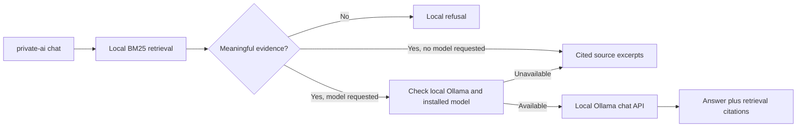

# Local RAG MVP

Status: v0.2.0 released; v0.2.1 quality improvements in development.

The local RAG MVP adds optional model-generated answers to the existing local
retrieval flow. It uses a local JSON index with BM25 scoring so the grounding
and fallback contract can be proven without adding cloud services, automatic
model downloads, Docker deployment, or production infrastructure.

## Architecture



## CLI Contract

Retrieval-only behavior remains the default:

```bash
private-ai chat "What are the AI usage rules?" --index generated/index/index.json
```

Optional local generation requires an explicit installed model:

```bash
private-ai chat "What are the AI usage rules?" --index generated/index/index.json --model <installed-model>
```

Optional flags:

| Flag | Default | Behavior |
| --- | --- | --- |
| `--model` | unset | Enables local Ollama generation only when explicitly supplied. |
| `--ollama-url` | `http://127.0.0.1:11434` | Must resolve to a loopback hostname in v0.2. |
| `--ollama-timeout` | `60` | Local API timeout in seconds. |
| `--top-k` | `3` | Maximum retrieved chunks supplied as evidence; accepted range is 1 through 10. |

## Grounding Flow

1. Load the existing local index.
2. Score chunks with BM25; common and low-information words do not affect
   ranking.
3. Remove results scoring below 65 percent of the strongest result.
4. Remove common and low-information query words from the evidence decision.
   Generic words such as `present`, `show`, and `tell` cannot establish support.
5. Refuse without invoking Ollama when meaningful-term coverage is too low.
6. Query local Ollama `/api/tags`.
7. Continue only if the requested model is already installed.
8. For indexed Markdown, select query-matching sections from each retrieved
   chunk so unrelated sections are not placed in the model context.
9. Send a system instruction, the question, and those numbered source sections
   to `/api/chat` with streaming disabled.
10. Instruct the model to use only supplied sources and return a fixed refusal
   token if support is insufficient.
11. Reject generated answers containing uncited lines or citation numbers
   outside the retrieved source range.
12. Reject claims without enough lexical overlap with their cited source.
13. Append source paths and chunk numbers from retrieval to the final output.

The client never calls `/api/pull`.

## Localhost Boundary

Accepted hosts:

- `127.0.0.1`
- `localhost`
- `::1`

The client rejects:

- Remote IP addresses
- Non-HTTP schemes
- URLs containing credentials
- URLs containing API paths, queries, or fragments
- Ollama cloud model names

The HTTP client also disables proxy use for local Ollama calls.

## Failure And Refusal Behavior

| Condition | Result |
| --- | --- |
| No `--model` | Retrieval-only cited excerpts |
| No meaningful retrieved evidence | Refusal; Ollama is not called |
| Ollama unavailable | Warning plus retrieval-only fallback |
| Requested model not installed | Warning plus retrieval-only fallback |
| Invalid Ollama response | Warning plus retrieval-only fallback |
| Missing or unknown model citation | Warning plus retrieval-only fallback |
| Model returns the refusal token | User-facing insufficient-evidence refusal |
| Model returns an answer | Model answer plus citations generated from retrieval |

Fallback is successful command behavior and returns exit code `0`. Invalid user
configuration, such as a non-loopback Ollama URL, returns a CLI usage error.

## Safety Properties

- No GPU requirement
- No model download
- No cloud endpoint or credentials
- No public network binding
- No firewall changes
- No production apply
- No change to denied-file ingestion rules
- No model invocation without retrieved evidence
- No model-provided source path trusted as a citation

## Tests

The v0.2.1 tests cover:

- Installed-model preflight before chat
- No automatic model download
- Cited model-answer output
- Missing and out-of-range model-citation rejection
- Unsupported-question refusal without model invocation
- Ollama-unavailable retrieval fallback
- Non-loopback and cloud-model rejection
- Denied-file exclusion
- Existing dry-run and validation behavior
- Existing retrieval-only chat behavior
- BM25 ranking and v0.2 index compatibility
- Claim-to-cited-source support validation
- Bounded source-code ingestion and exclusions
- Repeatable retrieval evaluation

## Verified Local Smoke Test

On 2026-06-27, the v0.2 flow was exercised end to end on Windows with Ollama
0.30.11 and the explicitly installed `llama3.2:1b` model:

- The sample AI-policy question returned only claims present in the selected
  AI source sections and included retrieval citations.
- An unrelated moon-minerals question was refused before Ollama was invoked.
- Ollama reported the model running locally on an NVIDIA RTX 3060 Laptop GPU.
- The warm supported query completed in 1.67 seconds and the pre-model refusal
  in 0.37 seconds on that machine. These observations are not benchmarks.

The same flow does not require a GPU; CPU performance depends on the selected
model and machine.

## Limitations

- BM25 retrieval is lexical, not semantic retrieval.
- A matching term does not prove that retrieved evidence fully answers a
  question.
- Prompt grounding reduces hallucination risk but cannot eliminate it.
- Absolute local privacy depends on the selected Ollama model actually being
  local; v0.2 rejects known cloud model suffixes but cannot inspect arbitrary
  custom model internals.
- Runtime authentication, user RBAC, vector storage, embeddings, deletion
  propagation, and production audit storage remain future work.

## Primary Ollama References

- [Ollama chat API](https://docs.ollama.com/api/chat)
- [Ollama installed-model API](https://docs.ollama.com/api/tags)
- [Ollama API errors](https://docs.ollama.com/api/errors)
- [Ollama streaming behavior](https://docs.ollama.com/api/streaming)
- [Ollama `llama3.2` model](https://ollama.com/library/llama3.2)
