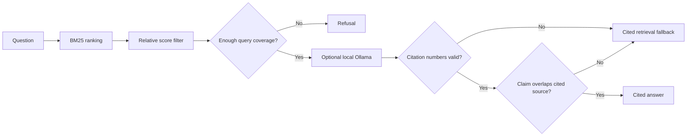

# RAG Quality And Code Ingestion v0.2.1

Status: development candidate.

v0.2.1 improves local retrieval quality and adds bounded source-code ingestion
without introducing embeddings, cloud services, public endpoints, or
production infrastructure.

## What Changed

- BM25 ranks chunks using term frequency, document frequency, and document
  length instead of counting matching words.
- Results scoring below 65 percent of the strongest result are removed before
  model invocation.
- Evidence must cover a minimum portion of meaningful query terms.
- Generated claims must cite an existing source and share meaningful lexical
  support with that cited source.
- `private-ai evaluate` runs repeatable supported and unsupported query cases.
- Source-code extensions can be indexed with generated, dependency, credential,
  and key paths denied by default.
- Operators can repeat `--exclude` for project-specific vendored or generated
  directories.
- Indexing is capped at 10,000 files and 2 MiB per file by default.
- v0.2 JSON indexes remain readable.

## Retrieval Flow



The lexical support check is a guardrail, not a proof that a claim is
semantically correct. Users must still inspect cited source text.

## Run The Evaluation

```bash
private-ai ingest examples/sample-company-docs --collection docs --output-dir generated/index --force
private-ai evaluate --index generated/index/index.json --cases examples/evaluation/local-rag-cases.json
```

Expected result:

```text
Passed: 4/4
```

Evaluation cases declare:

- A stable case ID
- A question
- Whether evidence should be retrieved
- Expected source file names for supported questions

## Safely Index Source Code

Supported code extensions include Kotlin, Java, Python, JavaScript,
TypeScript, XML, Gradle, Go, Rust, C/C++, C#, Swift, Dart, Ruby, PHP, shell,
PowerShell, SQL, and TOML.

Example:

```powershell
$project = "C:\path\to\your-project"

private-ai ingest $project `
  --collection project-code `
  --output-dir generated/project-code-index `
  --exclude autoeq_upstream `
  --exclude documentation/archive `
  --exclude "*.generated.*" `
  --max-files 5000 `
  --max-file-bytes 1048576 `
  --force
```

Default denied directories include:

- `.git`, `.gradle`, `.idea`, `.kotlin`, and `.vscode`
- `.venv`, `venv`, `node_modules`, and `vendor`
- `build`, `dist`, `out`, `target`, and `__pycache__`
- `third_party`, `packages`, `Pods`, `tmp`, and common test caches

Default denied files include likely environment files, credentials, tokens,
private keys, keystores, signing files, `google-services.json`,
`local.properties`, and common dependency lock files.

Symbolic links are not followed.

## Existing Index Compatibility

New indexes use schema version 2 and store term frequencies and token counts.
When v0.2 metadata is absent, the retriever calculates those values from the
stored chunk text at query time.

## Verified Android Project Smoke Test

On 2026-06-27, a reviewed Android application source tree and README were
indexed with a 1 MiB file limit:

- 193 files and 1,796 chunks were indexed.
- One oversized JSON dataset and unsupported WebP assets were skipped.
- A component question returned a grounded GenreDetector and EQManager answer.
- The included retrieval evaluation passed 4/4.

## Known Limitations

- BM25 is lexical and does not understand synonyms like an embedding model.
- Relative score filtering can trade recall for cleaner model context.
- Claim support is based on word overlap, not natural-language entailment.
- File-name and path rules cannot detect every secret inside otherwise
  approved source files.
- Users must review sources and provide project-specific exclusions.
- Runtime RBAC, audit storage, semantic vectors, and deletion propagation are
  not implemented.
