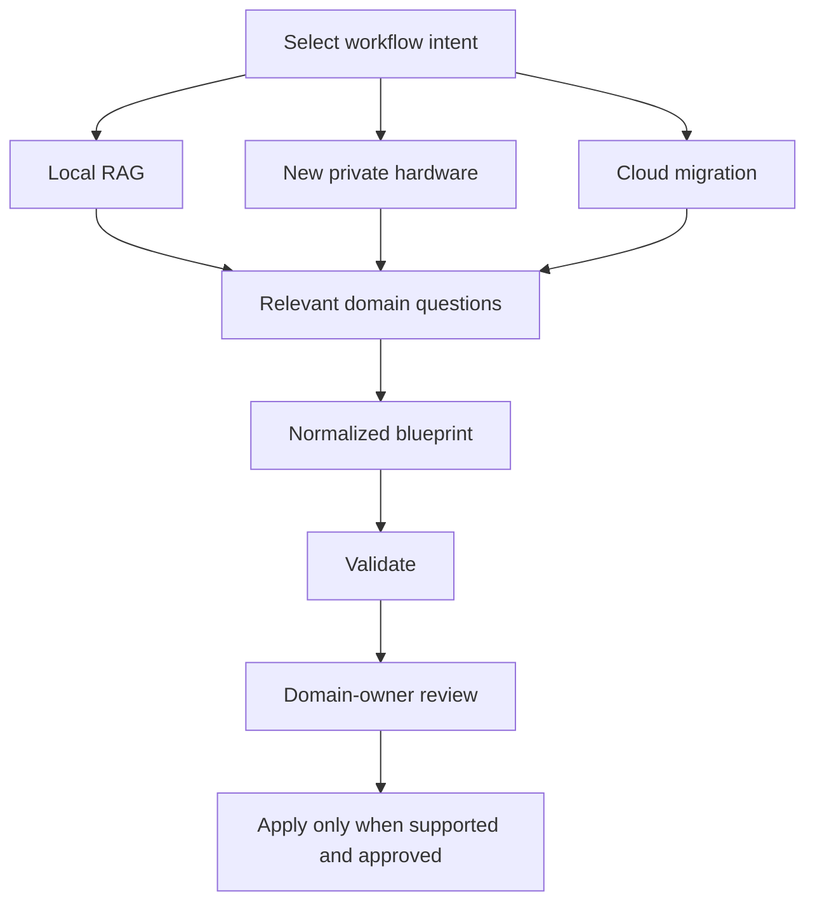

# Stakeholder Workflow

Private AI deployments fail when a single person guesses what every stakeholder needs. The guided architect should first select the user's workflow, then ask each relevant role only the decisions they own and generate artifacts that can be reviewed before deployment.

## Workflow Overview

The same person may fill multiple roles in a small company, but ownership and
questions should remain separate. Local users should not see irrelevant cloud
or enterprise questions.

## Manager / Business Owner

Owns business intent and risk acceptance.

Questions:

- What business problem should the AI system solve?
- Which departments will use it?
- Which data types are allowed?
- Which data types are forbidden?
- Who approves production deployment?
- Who owns operational risk?
- Should the system be internal-only or remotely accessible?
- Is this a proof of concept or production system?

Outputs:

- `company-ai-charter.md`
- `department-scope.md`
- `risk-ownership.md`

## Developer

Owns local setup, integration, and application behavior.

Questions:

- Is this local dev, staging, or production?
- Which files or folders are approved for ingestion?
- Which UI should be enabled?
- Which backend runtime should be used?
- Is GPU available?
- Should developer assistant mode be enabled?
- Should any code actions be allowed, or is the assistant read-only?

Outputs:

- `.env`
- `docker-compose.yml`
- `rag-config.yaml`
- `developer-mode.md`

## Network Engineer

Owns connectivity and exposure.

Questions:

- Should access be localhost-only, LAN-only, VPN-only, or hybrid gateway?
- Which ports are allowed?
- Which private IP ranges are used?
- Is WireGuard, OpenVPN, Tailscale, or another Zero Trust option preferred?
- Is DNS required?
- Should public internet access be blocked?
- Are outbound model downloads allowed?
- Who approves remote access?

Outputs:

- `network-plan.md`
- `firewall-rules.md`
- `vpn-template.conf`
- `allowed-ports.md`

## Security Engineer

Owns guardrails, permissions, logging, and risk review.

Questions:

- What roles exist?
- Which users can access which collections?
- Should audit logging be immutable?
- Should prompts and responses be logged, redacted, or hashed?
- Should file names be masked?
- Which actions require approval?
- Should cyber mode be read-only?
- Should prompt-injection filters be enabled?
- What incident response path applies if data is exposed?

Outputs:

- `rbac.yaml`
- `audit-policy.yaml`
- `guardrails.yaml`
- `security-review.md`

## Data Engineer / Data Owner

Owns data-source approval and ingestion rules.

Questions:

- Which data sources are approved?
- Are PDF, DOCX, Markdown, CSV, logs, databases, file shares, or repositories allowed?
- Which paths are explicitly denied?
- How often should ingestion run?
- Should deleted files be removed from the index?
- What metadata is required?
- How should sensitive file names be handled?
- Who approves future source additions?

Outputs:

- `data-sources.yaml`
- `ingestion-plan.md`
- `chunking-policy.yaml`
- `metadata-policy.yaml`

## AI Engineer

Owns model, embeddings, retrieval, and evaluation.

Questions:

- Which LLM runtime should be used?
- Which model should be used?
- Which embedding model should be used?
- Which vector database should be used?
- What chunk size and overlap should be used?
- Should hybrid search be enabled?
- Should a reranker be enabled?
- Are citations required?
- Should answers be blocked when confidence is low?
- What evaluation set proves the assistant is useful and safe?

Outputs:

- `model-config.yaml`
- `retrieval-config.yaml`
- `embedding-config.yaml`
- `eval-plan.md`

## Privacy, Legal, And Compliance Reviewer

Owns framework applicability and evidence requirements. The tool supports this
review but does not determine legal compliance.

Questions:

- Which jurisdictions and contractual obligations apply?
- Which data classifications are in scope?
- Where may data be stored, processed, and transmitted?
- May prompts or responses transit a managed cloud gateway?
- Which retention, deletion, and access evidence is required?
- Is a privacy or data-protection impact assessment required?
- Which controls require organizational or physical evidence outside the tool?
- Who is authorized to accept unresolved compliance risk?

Outputs:

- `governance-requirements.yaml`
- `data-flow-and-residency.md`
- `human-evidence-checklist.md`
- `privacy-review.md`

Framework selections must be marked `unverified` until an authorized reviewer
confirms applicability. Generated reports must not claim certification.

## Migration Owner

Owns source workload scope, acceptance criteria, cutover, and rollback.

Questions:

- Which exact cloud AI workload is being migrated?
- Which applications and API behaviors depend on it?
- What quality, latency, throughput, and availability must be preserved?
- Is shadow comparison required?
- What conditions permit or stop a canary?
- What triggers immediate rollback?
- Who may change production traffic?

Outputs:

- `source-scope.md`
- `compatibility-report.md`
- `migration-plan.md`
- `verification-plan.md`
- `rollback-plan.md`

## Handoff Rules

- Every generated artifact must list its owner.
- Unknown answers should be marked as unresolved rather than guessed.
- Blocking risks must prevent `apply`.
- Optional warnings should be visible in the validation report.
- A single approver can approve only the domains they own.
- Production deployment requires business, security, network, and data approval.
- Compliance framework labels activate questions and evidence checks but never
  create an automatic compliance approval.
- Cloud discovery must use a separately approved read-only permission scope.
- Production cutover requires an approved blueprint revision, acceptance
  criteria, named operators, and rollback criteria.
